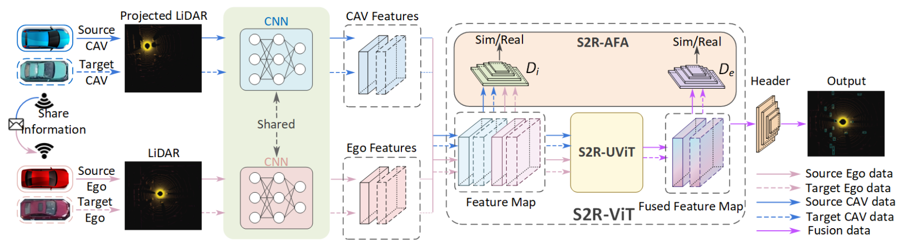
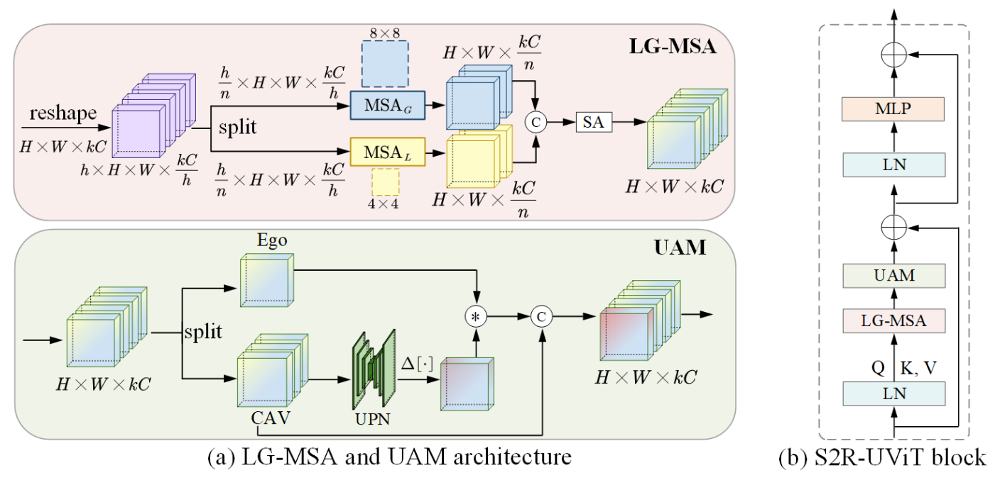

<!--
 * @Descripttion: 
 * @version: 
 * @Author: Jinlong Li CSU PhD
 * @Date: 2024-07-11 13:51:21
 * @LastEditors: Jinlong Li CSU PhD
 * @LastEditTime: 2024-07-11 13:59:30
-->
# S2R-ViT for multi-agent cooperative perception: Bridging the gap from simulation to reality
[](https://arxiv.org/pdf/2303.07601.pdf)


This is the official implementation of ICRA 2042 paper. "S2R-ViT for multi-agent cooperative perception: Bridging the gap from simulation to reality".
[Jinlong Li](https://jinlong17.github.io/)
[Runsheng Xu](https://derrickxunu.github.io/)
[Xinyu Liu]()
[Baolu Li]()
[Qin Zou]()
[Jiaqi Ma](https://mobility-lab.seas.ucla.edu/)
[Hongkai Yu](https://scholar.google.com/citations?user=JnQts0kAAAAJ&hl=en)


IEEE International Conference on Robotics and Automation (ICRA) 2024!


<p align="center">
  
</p>

 
## S2R-UViT: Simulation-to-Reality Uncertainty-aware Vision Transformer


<p align="center">
  
</p>

 
## Data  Download

We conduct experiments on two public benchmark datasets (OPV2V, V2V4Real) for the V2V cooperative perception task You can download these data from [OPV2V]() and [V2V4Real]().


## Getting Started

### Environment Setup


To set up the codebase environment, do the following steps:
#### 1. Create conda environment (python >= 3.7)
```shell
conda create -n v2v4real python=3.7
conda activate v2v4real
```
#### 2. Pytorch Installation (>= 1.12.0 Required)
Take pytorch 1.12.0 as an example:
```shell
conda install pytorch==1.12.0 torchvision==0.13.0 cudatoolkit=11.3 -c pytorch -c conda-forge
```
#### 3. spconv 2.x Installation
```shell
pip install spconv-cu113
```
#### 4. Install other dependencies
```shell
pip install -r requirements.txt
python setup.py develop
```
#### 5.Install bbx nms calculation cuda version
```shell
python opencood/utils/setup.py build_ext --inplace
```


### Train your model
OpenCOOD uses yaml file to configure all the parameters for training. To train your own model
from scratch or a continued checkpoint, run the following commonds:
```python
python opencood/tools/train.py --hypes_yaml ${CONFIG_FILE} [--model_dir  ${CHECKPOINT_FOLDER} --half]
```
Arguments Explanation:
- `hypes_yaml`: the path of the training configuration file, e.g. `opencood/hypes_yaml/point_pillar_fax.yaml`, meaning you want to train
CoBEVT with pointpillar backbone. See [Tutorial 1: Config System](https://opencood.readthedocs.io/en/latest/md_files/config_tutorial.html) to learn more about the rules of the yaml files.
- `model_dir` (optional) : the path of the checkpoints. This is used to fine-tune the trained models. When the `model_dir` is
given, the trainer will discard the `hypes_yaml` and load the `config.yaml` in the checkpoint folder.
- `half` (optional): If set, the model will be trained with half precision. It cannot be set with multi-gpu training togetger.

To train on **multiple gpus**, run the following command:
```
CUDA_VISIBLE_DEVICES=0,1,2,3 python -m torch.distributed.launch --nproc_per_node=4  --use_env opencood/tools/train.py --hypes_yaml ${CONFIG_FILE} [--model_dir  ${CHECKPOINT_FOLDER}]
```
### Test the model
Before you run the following command, first make sure the `validation_dir` in config.yaml under your checkpoint folder
refers to the testing dataset path, e.g. `v2v4real/test`.

```python
python opencood/tools/inference.py --model_dir ${CHECKPOINT_FOLDER} --fusion_method ${FUSION_STRATEGY} [--show_vis] [--show_sequence]
```


## Citation
```shell
@inproceedings{xu2023v2v4real,
  title={V2V4Real: A Real-world Large-scale Dataset for Vehicle-to-Vehicle Cooperative Perception},
  author={Xu, Runsheng and Xia, Xin and Li, Jinlong and Li, Hanzhao and Zhang, Shuo and Tu, Zhengzhong and Meng, Zonglin and Xiang, Hao and Dong, Xiaoyu and Song, Rui and Yu, Hongkai and Zhou, Bolei and Ma, Jiaqi},
  booktitle={The IEEE/CVF Computer Vision and Pattern Recognition Conference (CVPR)},
  year={2023}
}
```

## Acknowledgment
The codebase is build upon [OpenCOOD](https://github.com/DerrickXuNu/OpenCOOD), which is the first Open Cooperative Detection framework for autonomous driving.